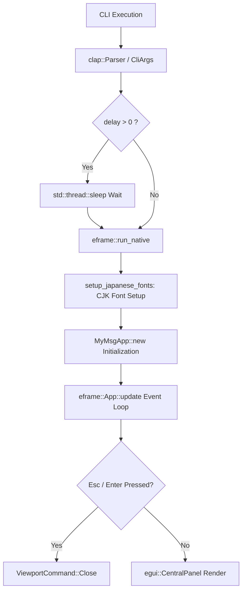
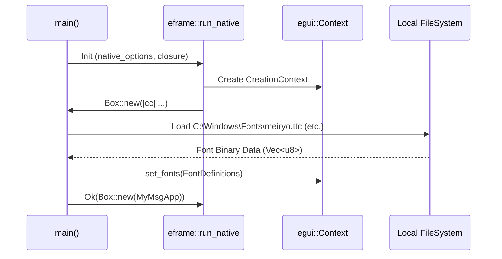

# MyMsg Architecture Design (ARCHITECTURE)

This document details the internal architecture, data flow, module breakdown, state management, rendering lifecycle, and error handling model of `MyMsg`.

---

## 1. Architectural Overview

`MyMsg` is built upon Rust's strict safety/ownership model and `eframe` (Immediate Mode GUI), delivering zero-overhead desktop popup alerts.



---

## 2. Module & Struct Architecture

### 2.1 `CliArgs` (Command-Line Arguments)
Derived via `clap::Parser` to map command-line flags safely into typed fields:

```rust
pub struct CliArgs {
    pub message_arg: Option<String>,
    pub message_opt: Option<String>,
    pub size: String,
    pub font_size: Option<f32>,
    pub color: String,
    pub bg_color: Option<String>,
    pub blink: bool,
    pub font: String,
    pub delay: u64,
}
```

### 2.2 `MyMsgApp` (Application State)
Holds execution state during GUI runtime:

```rust
pub struct MyMsgApp {
    pub message: String,          // Display string
    pub text_color: Color32,      // Base text color
    pub bg_color: Color32,        // Background color
    pub font_id: FontId,          // Font size & family
    pub blink: bool,              // Blink animation flag
    pub start_time: Instant,      // Start time for phase calculation
}
```

---

## 3. Rendering Lifecycle & Event Loop

### 3.1 Immediate Mode GUI Model
`egui` re-evaluates UI definitions on every frame triggered by events:

1. **Input Handling Phase**:
   Uses `ctx.input(|i| ...)` to intercept `Escape` and `Enter` key presses, instantly issuing `ViewportCommand::Close`.
2. **Blink Animation Phase**:
   If `blink == true`, computes opacity phase from `start_time.elapsed()` and requests low-power repaints via `ctx.request_repaint_after(Duration::from_millis(250))`.
3. **Panel Layout Phase**:
   Applies slim framing margins (`Margin::symmetric(16.0, 10.0)`) in `egui::CentralPanel` to render centered text and the bottom action bar.

---

## 4. Font Pipeline (`setup_japanese_fonts`)

When the GUI context initializes (`cc.egui_ctx`), system CJK fonts are loaded dynamically from OS paths:



---

## 5. Error Handling Model

- **CLI Syntax Errors**: `clap` outputs clear errors and usage instructions to stderr, exiting with non-zero code.
- **Color Parsing Failures**: Unrecognized colors fall back safely to defaults (text: `#F0F0F0`, background: `#1A1B26`).
- **Font Missing**: If system fonts are missing, falls back cleanly to default built-in fonts without panicking.
- **Out-of-Range Delays**: Clamped safely to `0`–`3600` seconds via `clamp_delay_seconds`.
