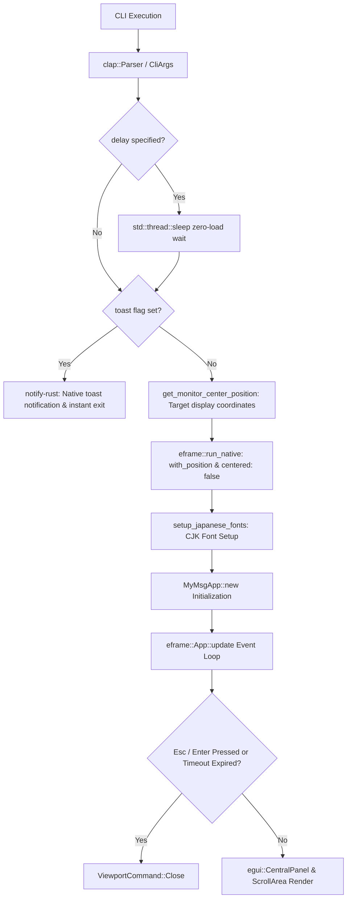
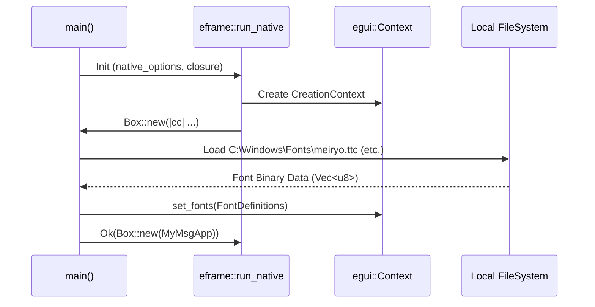

# MyMsg Architecture Design (ARCHITECTURE)

This document details the internal architecture, data flow, module breakdown, state management, rendering lifecycle, and error handling model of `MyMsg`.

---

## 1. Architectural Overview

`MyMsg` is built upon Rust's strict safety/ownership model and `eframe` (Immediate Mode GUI), delivering zero-overhead desktop popup alerts.



---

## 2. Source Code Module Breakdown

The codebase is organized into 7 focused modules by responsibility:

```
src/
├── main.rs       # Application entry point (main, delay sleep, viewport setup, toast dispatch)
├── cli.rs        # CLI argument models (CliArgs, IconType, ThemeMode, MonitorTarget, delay parsing)
├── color.rs      # Color & theme parser (parse_color, ThemePalette, palette resolver)
├── font.rs       # System font auto-detection & registration (setup_japanese_fonts)
├── monitor.rs    # Multi-monitor display positioning (Win32 EnumDisplayMonitors API)
├── toast.rs      # Native OS desktop toast notification dispatch (notify-rust)
└── app.rs        # GUI state model (MyMsgApp) & rendering loop (eframe::App, timeout watcher)
```

---

## 3. Core Structs & Data Types

### 3.1 `CliArgs` (`src/cli.rs`)
Derived via `clap::Parser` to map command-line flags safely into typed fields:

```rust
pub struct CliArgs {
    pub message_arg: Option<String>,
    pub message_opt: Option<String>,
    pub size: String,
    pub font_size: Option<f32>,
    pub color: Option<String>,
    pub bg_color: Option<String>,
    pub blink: bool,
    pub font: String,
    pub icon: Option<String>,
    pub theme: String,
    pub delay: String,
    pub monitor: String,
    pub timeout: u64,
    pub toast: bool,
}
```rust
pub struct MyMsgApp {
    pub message: String,
    pub custom_text_color: Option<String>,
    pub custom_bg_color: Option<String>,
    pub theme_mode: ThemeMode,
    pub icon: Option<IconType>,
    pub font_id: FontId,
    pub font_size: f32,
    pub blink: bool,
    pub timeout_secs: u64,
    pub start_time: Instant,
}
```

---

## 4. Rendering Lifecycle & Event Loop

### 4.1 Immediate Mode GUI Model
`egui` re-evaluates UI definitions on every frame triggered by events:

1. **Input & Dismissal Phase**:
   - Intercepts `Escape` and `Enter` key presses, instantly issuing `ViewportCommand::Close`.
   - If `timeout_secs > 0` and elapsed time reaches the threshold, `ViewportCommand::Close` is emitted automatically.
2. **Blink Animation Phase**:
   If `blink == true`, computes opacity phase from `start_time.elapsed()` and requests low-power repaints via `ctx.request_repaint_after(Duration::from_millis(250))`.
3. **Panel Layout Phase**:
   Applies slim framing margins in `egui::CentralPanel` to render centered text and the bottom action bar.

---

## 5. Font Pipeline (`setup_japanese_fonts`)

When the GUI context initializes (`cc.egui_ctx`), system CJK fonts are loaded dynamically from OS paths:



---

## 6. Error Handling Model

- **CLI Syntax Errors**: `clap` outputs clear errors and usage instructions to stderr, exiting with non-zero code.
- **Color Parsing Failures**: Unrecognized colors fall back safely to theme default colors.
- **Font Missing**: If system fonts are missing, falls back cleanly to default built-in fonts without panicking.
- **Out-of-Range Delays**: Clamped safely to `0`–`86400` seconds (24 hours) via `clamp_delay_seconds`.
- **Monitor Target Fallback**: If an invalid monitor index is targeted, falls back seamlessly to the primary display.
