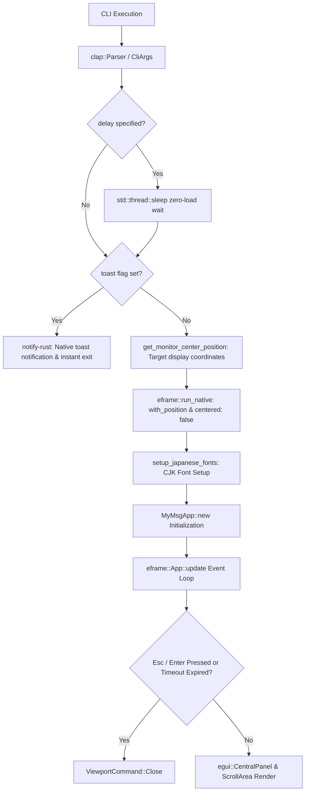
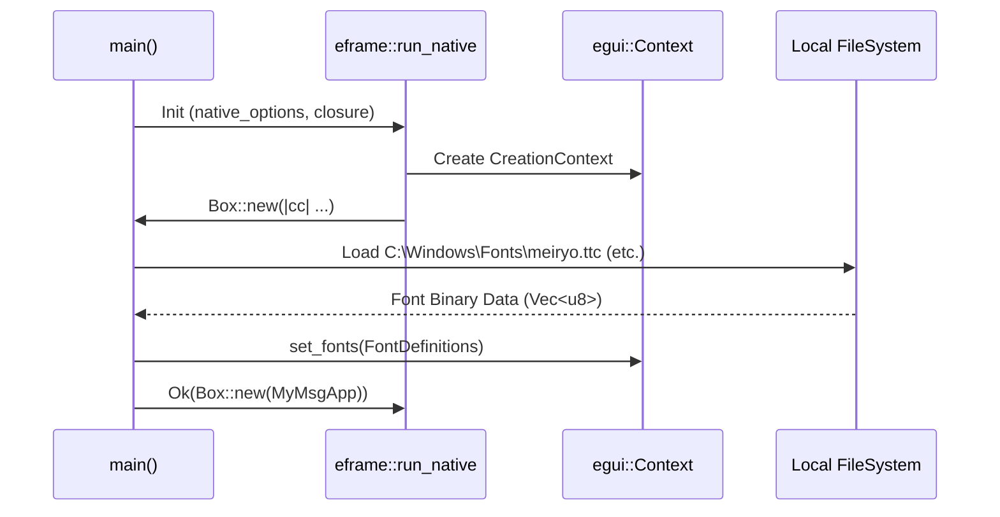

# MyMsg Architecture Design (ARCHITECTURE)

This document details the internal architecture, data flow, module breakdown, state management, rendering lifecycle, and error handling model of `MyMsg`.

---

## 1. Architectural Overview

`MyMsg` is built upon Rust's strict safety/ownership model and `eframe` (Immediate Mode GUI), delivering zero-overhead desktop popup alerts.


```mermaid
graph TD
    CLI[CLI Execution] --> ArgParser[clap::Parser / CliArgs]
    ArgParser --> DelayCheck{delay specified?}
    DelayCheck -- Yes --> Sleep[std::thread::sleep zero-load wait]
    DelayCheck -- No --> ToastCheck
    Sleep --> ToastCheck{toast flag set?}
    ToastCheck -- Yes --> SendToast[notify-rust: Native toast notification & instant exit]
    ToastCheck -- No --> MonDetect[get_monitor_center_position: Target display coordinates]
    MonDetect --> WinInit[eframe::run_native: with_position & centered: false]
    WinInit --> FontSetup[setup_japanese_fonts: CJK Font Setup]
    FontSetup --> AppState[MyMsgApp::new Initialization]
    AppState --> EventLoop[eframe::App::update Event Loop]
    EventLoop --> KeyCheck{Esc / Enter Pressed or Timeout Expired?}
    KeyCheck -- Yes --> CloseCmd[ViewportCommand::Close]
    KeyCheck -- No --> Render[egui::CentralPanel & ScrollArea Render]
```

---

## 2. Source Code Module Breakdown

The codebase is organized into focused submodules by responsibility:

```
src/
├── main.rs       # Application entry point (main, session check, delay sleep, interval runner, toast dispatch)
├── cli/          # CLI argument parsing, models, and calculation submodule
│   ├── mod.rs    # Submodule declarations and re-exports for full backwards compatibility
│   ├── args.rs   # CliArgs struct schema definition and clap attributes
│   ├── types.rs  # IconType, ThemeMode, MonitorTarget enums and parser functions
│   ├── time.rs   # Duration units, delay parsing, and scheduled loop wait calculations
│   └── layout.rs # Window dimension calculations, font sizing, and newline resolution
├── color.rs      # Color & theme parser (parse_color, ThemePalette, palette resolver)
├── font.rs       # System font auto-detection & registration (setup_japanese_fonts)
├── monitor.rs    # Multi-monitor display positioning (Win32 EnumDisplayMonitors API)
├── toast.rs      # Native OS desktop toast notification dispatch (notify-rust)
├── app.rs        # GUI state model (MyMsgApp) & rendering loop (eframe::App, timeout watcher, action buttons)
├── log.rs        # Event logging module (append_log, lifecycle & user action tracing)
├── session.rs    # Interactive session & Session 0 detection module (is_interactive_session)
└── sound.rs      # System notification chime / beep playback module (play_notification_sound)
```

---

## 3. Core Structs & Data Types

### 3.1 `CliArgs` (`src/cli/args.rs`)
Derived via `clap::Parser` to map command-line flags safely into typed fields:

```rust
pub struct CliArgs {
    pub message_arg: Option<String>,
    pub message_opt: Option<String>,
    pub size: String,
    pub font_size: Option<f32>,
    pub color: Option<String>,
    pub bg_color: Option<String>,
    pub blink: bool,
    pub font: String,
    pub icon: Option<String>,
    pub theme: String,
    pub delay: String,
    pub monitor: String,
    pub timeout: u64,
    pub toast: bool,
    pub interval: Option<String>,
    pub at: Option<String>,
    pub count: u64,
    pub immediate: bool,
    pub show_progress: bool,
    pub log: Option<std::path::PathBuf>,
    pub copy: bool,
    pub action: Option<String>,
    pub sound: bool,
}
```

### 3.2 `MyMsgApp` (`src/app.rs`)
Holds the active runtime GUI state:

```rust
pub struct MyMsgApp {
    pub message: String,
    pub custom_text_color: Option<String>,
    pub custom_bg_color: Option<String>,
    pub theme_mode: ThemeMode,
    pub icon: Option<IconType>,
    pub font_id: FontId,
    pub font_size: f32,
    pub blink: bool,
    pub timeout_secs: u64,
    pub show_progress: bool,
    pub log_path: Option<PathBuf>,
    pub copy_enabled: bool,
    pub copied_feedback_until: Option<Instant>,
    pub action_cmd: Option<String>,
    pub action_feedback_until: Option<(Instant, bool)>,
    pub start_time: Instant,
    pub interval_secs: Option<u64>,
    pub schedule_time: Option<chrono::NaiveTime>,
    pub max_count: u64,
    pub current_count: u64,
    pub should_exit_all: std::sync::Arc<std::sync::atomic::AtomicBool>,
    pub is_closing: bool,
}
```

---

## 4. Rendering Lifecycle & Event Loop

### 4.1 Immediate Mode GUI Model
`egui` re-evaluates UI definitions on every frame triggered by events:

1. **Input & Dismissal Phase**:
   - `Escape` key press (or clicking `[✕ 中止]` button): Sets `should_exit_all` to `true` and cleanly terminates the process, even during recurring intervals.
   - `Enter` key press (or clicking `[✓ 今回閉じる]` button): Dismisses current notification and proceeds to the next scheduled interval without setting `should_exit_all`. Exits process if no future schedule remains.
   - If `timeout_secs > 0` and elapsed time reaches threshold, emits `ViewportCommand::Close` (progresses to next schedule if interval is active).
2. **Blink Animation Phase**:
   If `blink == true`, computes opacity phase from `start_time.elapsed()` and requests low-power repaints via `ctx.request_repaint_after(Duration::from_millis(250))`.
3. **Panel Layout Phase**:
   Applies slim framing margins in `egui::CentralPanel` to render centered text and bottom action bar buttons (copy, action, dismiss/abort).

---

## 5. Font Pipeline (`setup_japanese_fonts`)

When the GUI context initializes (`cc.egui_ctx`), system CJK fonts are loaded dynamically from OS paths:


```mermaid
sequenceDiagram
    participant Main as main()
    participant Runner as eframe::run_native
    participant Ctx as egui::Context
    participant FS as Local FileSystem

    Main->>Runner: Init (native_options, closure)
    Runner->>Ctx: Create CreationContext
    Runner->>Main: Box::new(|cc| ...)
    Main->>FS: Load C:\Windows\Fonts\meiryo.ttc (etc.)
    FS-->>Main: Font Binary Data (Vec<u8>)
    Main->>Ctx: set_fonts(FontDefinitions)
    Main->>Runner: Ok(Box::new(MyMsgApp))
```

---

## 6. Error Handling Model

- **CLI Syntax Errors**: `clap` outputs clear errors and usage instructions to stderr, exiting with non-zero code.
- **Color Parsing Failures**: Unrecognized colors fall back safely to theme default colors.
- **Font Missing**: If system fonts are missing, falls back cleanly to default built-in fonts without panicking.
- **Out-of-Range Delays**: Clamped safely to `0`–`86400` seconds (24 hours) via `clamp_delay_seconds`.
- **Monitor Target Fallback**: If an invalid monitor index is targeted, falls back seamlessly to the primary display.
