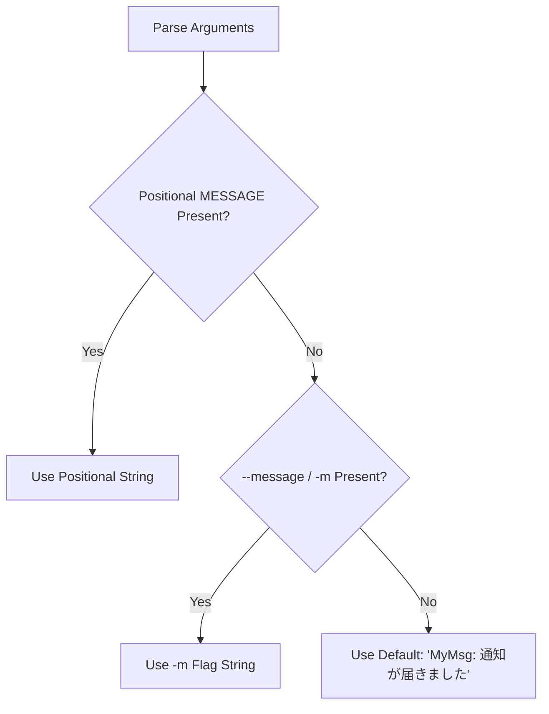

# MyMsg Detailed Functional Specification (SPECIFICATION)

This document defines the detailed functional specifications, command-line arguments, UI behaviors, font and color processing, exit triggers, and constraints of the ultra-lightweight, Always-on-Top popup notification CLI tool `MyMsg`.

---

## 1. Overview & Execution Model

`MyMsg` is a standalone desktop notification utility developed in Rust using the `eframe` (`egui`) GUI framework and `clap` command-line argument parser.

- **Execution Model**: Runs as a single synchronous process.
- **Window Model**: Spawns a native OS window pinned Always-on-Top with fixed dimensions.
- **Rendering Model**: Event-driven rendering (0% CPU utilization while idle; repaints only on interaction or during blink animation).

---

## 2. Command-Line Arguments Specification

The CLI syntax parsed via `clap` (derive macro) is as follows:

```
Usage: MyMsg.exe [OPTIONS] [MESSAGE]
```

### 2.1 Positional Arguments

| Argument | Type | Required | Description |
| :--- | :--- | :---: | :--- |
| `MESSAGE` | String | Optional | Message string to display (1st positional argument). |

### 2.2 Options & Flags

| Long Flag | Short | Value Type | Default Value | Description |
| :--- | :---: | :---: | :---: | :--- |
| `--message` | `-m` | `String` | None | Message string to display. |
| `--size` | `-s` | `String` | `"medium"` | Window size preset (`small`, `medium`, `large` or `s`, `l`). |
| `--font-size`| - | `f32` | None | Message font size in points. Overrides the preset default font size. |
| `--color` | `-c` | `String` | `"white"` | Text color. Supports named colors, 1-char shorthands, typos, and HEX codes. |
| `--bg-color` | - | `String` | `"#1a1b26"` | Window background color. Supports HEX codes or named colors. |
| `--blink` | `-b` | `bool` | `false` | Enables message text blinking animation (~0.5s cycle). |
| `--font` | `-f` | `String` | `"default"`| Font family (`default`/`sans`, `mono`/`2`/`monospace`, `serif`/`3`, `impact`). |
| `--delay` | `-d` | `u64` | `0` | Delay duration in seconds before popup appears (capped at 3600s). |
| `--help` | `-h` | - | - | Print help information and exit. |
| `--version` | `-V` | - | - | Print version information and exit. |

---

## 3. Message Priority Resolution Logic (`resolve_message`)

The message string to be displayed is resolved according to the following strict hierarchy:



---

## 4. Window Dimensions & Font Size Calculation (`calculate_window_dimensions`)

Calculates width, height, and font size based on `--size` (`-s`) and `--font-size`:

| Size Preset | Matching Keywords | Width | Height | Default Font Size (pt) |
| :--- | :--- | :---: | :---: | :---: |
| **Small** | `small`, `s` | 300.0 px | 150.0 px | 20.0 pt |
| **Medium** (Default) | `medium`, others | 450.0 px | 220.0 px | 26.0 pt |
| **Large** | `large`, `l` | 650.0 px | 350.0 px | 36.0 pt |

> [!NOTE]
> When `--font-size <pt>` is explicitly provided, the preset default font size is overridden while preserving the window dimensions.

---

## 5. Color Parser Specification (`parse_color`)

Case-insensitive color parsing supporting standard names, shorthands, typos, and HEX codes:

### 5.1 Standard Names & Shorthands

| Color Name | Shorthand | Japanese | Typo Tolerance | RGB Value (HEX) |
| :--- | :---: | :---: | :---: | :--- |
| `red` | `r` | `赤` | - | `#EF4444` (239, 68, 68) |
| `green` | `g` | `緑` | - | `#22C55E` (34, 197, 94) |
| `blue` | `b` | `青` | `bule` | `#3B82F6` (59, 130, 246) |
| `yellow` | `y` | `黄` | - | `#EAB308` (234, 179, 8) |
| `orange` | `o` | - | - | `#F97316` (249, 115, 22) |
| `purple` | `p` | - | - | `#A855F7` (168, 85, 247) |
| `cyan` | `c` | - | - | `#06B6D4` (6, 182, 212) |
| `pink` / `magenta` | `m` | - | - | `#EC4899` (236, 72, 153) |
| `white` | `w` | `白` | - | `#FFFFFF` (255, 255, 255) |
| `black` | `k` | `黒` | - | `#0A0A0F` (10, 10, 15) |

### 5.2 Extended Palette Colors
`lime`, `gold`, `amber`, `emerald`, `teal`, `sky`, `indigo`, `violet`, `rose`, `crimson`, `navy`, `gray` / `grey` / `gray500`, `dark` / `darkgray`, `light` / `lightgray`

### 5.3 HEX Color Code Formats
- **6-digit HEX**: `#RRGGBB` or `RRGGBB`
- **3-digit HEX**: `#RGB` or `RGB` (e.g. `#F00` → `#FF0000`)
- **8-digit HEX**: `#RRGGBBAA` or `RRGGBBAA` (including alpha transparency)

---

## 6. Zero-Resource Delay & Timer (`clamp_delay_seconds`)

When `--delay <SEC>` (`-d`) is supplied:
1. Seconds are clamped safely to `0`–`3600` (max 1 hour) via `clamp_delay_seconds(delay)`.
2. The process sleeps via `std::thread::sleep` **before** GUI initialization (`eframe::run_native`).
3. No graphics contexts or window handles exist during sleep, yielding true 0% CPU and minimal memory.

---

## 7. Blinking Animation Specification (`--blink`)

When `--blink` (`-b`) is enabled:
- Evaluates `(elapsed % 1.0) < 0.5` against `start_time.elapsed()`.
- Phase 1 (0.0s–0.5s): Rendered with full opacity (`Alpha = 255`).
- Phase 2 (0.5s–1.0s): Rendered with attenuated opacity (`Alpha = 30`).
- Schedules low-power repaints using `ctx.request_repaint_after(Duration::from_millis(250))`.

---

## 8. Japanese / CJK Font Auto-Detection (`setup_japanese_fonts`)

Detects and registers host system fonts into `egui::FontDefinitions`:

- **Windows**: `meiryo.ttc`, `YuGothM.ttc`, `msgothic.ttc`, `msmincho.ttc` (Serif)
- **macOS**: `Hiragino Sans GB.ttc`, `PingFang.ttc`
- **Linux**: `NotoSansCJK-Regular.ttc`

Registered Font Families:
- `FontFamily::Proportional`: Prepended as primary fallback.
- `FontFamily::Monospace`: Appended to fallback list.
- `FontFamily::Name("serif")`: Configured with Japanese Mincho/CJK font.

---

## 9. User Interaction & Exit Conditions

| Action | Behavior | Exit Code |
| :--- | :--- | :---: |
| **Press `Esc` Key** | Closes window and exits immediately | `0` |
| **Press `Enter` Key** | Closes window and exits immediately | `0` |
| **Click `[✕ 閉じる (Esc / Enter)]` Button** | Closes window and exits immediately | `0` |
| **Click Window Titlebar Close `✕`** | Normal window disposal and exit | `0` |

---

## 10. Constraints
- Maximum delay time is 3600 seconds (1 hour).
- Designed for single-window notifications. Multiple invocations create independent processes.
