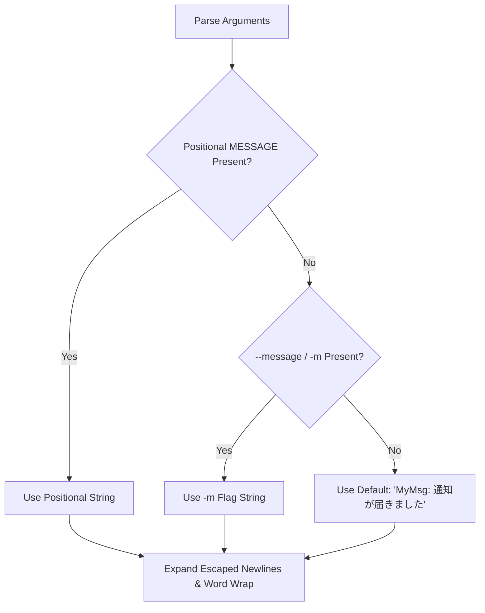

# MyMsg Detailed Functional Specification (SPECIFICATION)

This document defines the detailed functional specifications, command-line arguments, UI behaviors, font and color processing, exit triggers, and constraints of the ultra-lightweight, Always-on-Top popup notification CLI tool `MyMsg`.

---

## 1. Overview & Execution Model

`MyMsg` is a standalone desktop notification utility developed in Rust using the `eframe` (`egui`) GUI framework and `clap` command-line argument parser.

- **Execution Model**: Runs as a single synchronous process.
- **Window Model**: Spawns a native OS window pinned Always-on-Top with fixed dimensions.
- **Rendering Model**: Event-driven rendering (0% CPU utilization while idle; repaints only on interaction or during blink animation).

---

## 2. Command-Line Arguments Specification

The CLI syntax parsed via `clap` (derive macro) is as follows:

```
Usage: MyMsg.exe [OPTIONS] [MESSAGE]
```

### 2.1 Positional Arguments

| Argument | Type | Required | Description |
| :--- | :--- | :---: | :--- |
| `MESSAGE` | String | Optional | Message string to display (1st positional argument). |

### 2.2 Options & Flags

| Long Flag | Short | Value Type | Default Value | Description |
| :--- | :---: | :---: | :---: | :--- |
| `--message` | `-m` | `String` | None | Message string to display. |
| `--size` | `-s` | `String` | `"medium"` | Window size preset (`small`, `medium`, `large` or `s`, `l`). |
| `--font-size`| - | `f32` | None | Message font size in points. Overrides the preset default font size. |
| `--color` | `-c` | `String` | Default theme color | Text color. Supports named colors, 1-char shorthands, typos, and HEX codes. |
| `--bg-color` | - | `String` | Default theme color | Window background color. |
| `--blink` | `-b` | `bool` | `false` | Enables message text blinking animation (~0.5s cycle). |
| `--font` | `-f` | `String` | `"default"`| Font family (`default`/`sans`, `mono`/`2`/`monospace`, `serif`/`3`, `impact`). |
| `--icon` | `-i` | `String` | None | Icon symbol type (`info`, `warn`, `error`, `ok`). |
| `--theme` | `-t` | `String` | `"system"` | Theme preset (`system`, `dark`, `light`). |
| `--delay` | `-d` | `String` | `"0"` | Delay duration or time of day (`60`, `10m`, `12:00`, max 24h). |
| `--monitor`| - | `String` | `"cursor"` | Target monitor (`cursor`, `primary`, `0`, `1`, `2`...). |
| `--timeout`| - | `u64` | `0` | Auto-dismiss timer in seconds (0 to disable). |
| `--toast` | `-T` | `bool` | `false` | OS native toast notification mode (no GUI window, immediate exit). |
| `--help` | `-h` | - | - | Print help information and exit. |
| `--version` | `-V` | - | - | Print version information and exit. |

---

## 3. Message Resolution & Multi-Line Wrapping (`resolve_message`)

The message string to be displayed is resolved according to the following strict hierarchy and rules:

1. Positional argument `MESSAGE` takes highest priority.
2. `-m` / `--message` option string is used if provided.
3. Default notification text (`"MyMsg: 通知が届きました"`) is used if neither is provided.
4. Literal escape characters `\n` and `\r\n` are expanded into actual newlines.
5. Multi-line messages are automatically wrapped to fit the window width, and vertically scrollable via `egui::ScrollArea`.



---

## 4. Icon Display Specification (`--icon` / `-i`)

When `--icon <type>` is specified, a vector symbol icon is rendered on the left side of the message text:

| Keyword | Shorthands / Aliases | Symbol | Default Color |
| :--- | :--- | :---: | :--- |
| `info` | `i`, `information` | `ℹ` | `#38BDF8` (Sky Blue) |
| `warn` | `w`, `warning`, `alert` | `⚠` | `#FBBF24` (Amber / Yellow) |
| `error` | `e`, `err`, `danger`, `ng` | `✖` | `#F87171` (Light Red) |
| `ok` | `s`, `k`, `success`, `check` | `✔` | `#4ADE80` (Green) |

---

## 5. Theme Specification (`--theme` / `-t`)

`--theme` configures the cohesive visual palette:

| Theme | Behavior | Default Background | Default Text | Button Background |
| :--- | :--- | :---: | :---: | :---: |
| `system` (Default) | Automatically tracks OS light/dark mode | OS Dark/Light | OS Dark/Light | OS Dark/Light |
| `dark` (`d`) | Pinned Dark Mode | `#1A1B26` | `#F0F0F0` | `#2D3041` |
| `light` (`l`) | Pinned Light Mode | `#F8FAFC` | `#0F172A` | `#E2E8F0` |

> [!NOTE]
> Explicitly specified `--color` or `--bg-color` overrides the theme default colors.

---

## 6. Multi-Monitor & Center Placement Specification (`get_active_monitor_center_position`)

When running in multi-display setups, the popup window position is determined as follows:

1. **Active Monitor Auto-Detection (Windows)**:
   - Queries the physical cursor position at startup via `GetCursorPos` and resolves the target display handle via `MonitorFromPoint`.
   - Obtains the monitor's working area (`rcWork`: usable area excluding taskbars).
   - Computes physical center coordinates `X = rcWork.left + (rcWork.width - window_width) / 2` and `Y = rcWork.top + (rcWork.height - window_height) / 2`.
2. **eframe NativeOptions Coordination**:
   - `centered: false` is configured to prevent eframe from re-invoking `set_outer_position` to force-center onto the primary display post-creation.
3. **Fallback**:
   - On detection failure or non-Windows platforms, defaults to the default window manager position or primary display.

---

## 7. Window Dimensions & Font Size Calculation (`calculate_window_dimensions`)

Window dimensions and default font size are computed based on `--size` (`-s`) and `--font-size`:

| Size Preset | Matched Keywords | Width | Height | Default Font Size |
| :--- | :--- | :---: | :---: | :---: |
| **Small** | `small`, `s` | 300.0 px | 150.0 px | 20.0 pt |
| **Medium** (Default) | `medium`, any other | 450.0 px | 220.0 px | 26.0 pt |
| **Large** | `large`, `l` | 650.0 px | 350.0 px | 36.0 pt |

> [!NOTE]
> When `--font-size <pt>` is explicitly provided, it overrides the preset's default font size while preserving the preset window dimensions.

---

## 8. Color Parser Specification (`parse_color`)

The `--color` and `--bg-color` options accept case-insensitive color inputs:

### 8.1 Named Colors & 1-Character Abbreviations

| Color Name | 1-Char Shorthand | Japanese Name | Typo Auto-Correct | RGB Value (HEX) |
| :--- | :---: | :---: | :---: | :--- |
| `red` | `r` | `赤` | - | `#EF4444` (239, 68, 68) |
| `green` | `g` | `緑` | - | `#22C55E` (34, 197, 94) |
| `blue` | `b` | `青` | `bule` | `#3B82F6` (59, 130, 246) |
| `yellow` | `y` | `黄` | - | `#EAB308` (234, 179, 8) |
| `orange` | `o` | - | - | `#F97316` (249, 115, 22) |
| `purple` | `p` | - | - | `#A855F7` (168, 85, 247) |
| `cyan` | `c` | - | - | `#06B6D4` (6, 182, 212) |
| `pink` / `magenta` | `m` | - | - | `#EC4899` (236, 72, 153) |
| `white` | `w` | `白` | - | `#FFFFFF` (255, 255, 255) |
| `black` | `k` | `黒` | - | `#0A0A0F` (10, 10, 15) |

### 8.2 Extended Palette Names
`lime`, `gold`, `amber`, `emerald`, `teal`, `sky`, `indigo`, `violet`, `rose`, `crimson`, `navy`, `gray` / `grey` / `gray500`, `dark` / `darkgray`, `light` / `lightgray`

### 8.3 HEX Color Code Formats
- **6-digit HEX**: `#RRGGBB` or `RRGGBB`
- **3-digit HEX**: `#RGB` or `RGB` (e.g., `#F00` → `#FF0000`)
- **8-digit HEX**: `#RRGGBBAA` or `RRGGBBAA` (with alpha transparency)

---

## 9. Timer & Delayed Notification (`parse_delay_to_seconds`, `clamp_delay_seconds`)

When `--delay <spec>` (`-d`) is specified:
1. Input string is parsed flexibly:
   - **Seconds**: `60`, `300`, `3600`
   - **Units**: `10s`, `10m` (minutes), `1h` (hours)
   - **Time of Day**: `12:00`, `17:30:00` (auto-calculates difference from current local time; rollover to next day if past)
2. Calculated delay is safety-capped between `0` and `86400` seconds (24 hours) via `clamp_delay_seconds(delay)`.
3. The main thread sleeps using `std::thread::sleep` **before** initializing any GUI or window contexts.
4. Resource utilization (CPU and GPU memory) is strictly zero during sleep.

---

## 10. Blinking Animation Specification (`--blink`)

When `--blink` (`-b`) is enabled:
- Evaluates `(elapsed % 1.0) < 0.5` based on `start_time.elapsed().as_secs_f32()`.
- First 0.5s: Rendered in full text color opacity (`Alpha = 255`).
- Second 0.5s: Rendered with muted alpha transparency (`Alpha = 30`).
- Calls `ctx.request_repaint_after(Duration::from_millis(250))` to schedule low-overhead repainting.

---

## 11. Japanese & CJK Font Fallback (`setup_japanese_fonts`)

To prevent tofu glyphs for CJK/Japanese text, system fonts are dynamically discovered and registered at runtime:

- **Windows**: `meiryo.ttc`, `YuGothM.ttc`, `msgothic.ttc`, `msmincho.ttc`
- **macOS**: `Hiragino Sans GB.ttc`, `PingFang.ttc`
- **Linux**: `NotoSansCJK-Regular.ttc`

Registered Font Families:
- `FontFamily::Proportional`: Prepended as the highest priority font.
- `FontFamily::Monospace`: Appended as fallback font.
- `FontFamily::Name("serif")`: Mincho/serif font fallback.

---

## 12. Display & Monitor Placement (`--monitor`)

`--monitor <TARGET>` explicitly targets a display screen for popup centering:

| Target Value | Behavior |
| :--- | :--- |
| `cursor` (default) / `c`, `mouse`, `active` | Centers popup on the active display containing the mouse cursor |
| `primary` / `p`, `main` | Centers popup on the primary display work area |
| `0`, `1`, `2` ... | Centers popup on the display matching the specified enumerated index (falls back to primary if out of range) |

---

## 13. Auto-Dismissal Timer (`--timeout`)

When `--timeout <seconds>` is specified:
- Closes the window automatically after the elapsed duration and exits cleanly with exit code `0`.
- `0` (default) disables auto-dismissal, keeping the popup pinned until manually dismissed.

---

## 14. OS Native Toast Notification Mode (`--toast` / `-T`)

When `--toast` is specified:
- Bypasses GUI window creation and sends an OS-native desktop toast notification (Windows Action Center / macOS / Linux) directly.
- Exits immediately after dispatch with exit code `0`.
- Supports `--icon` symbols and `--delay` timers.

---

## 15. User Interaction & Dismissal Conditions

| Action / Trigger | Behavior | Exit Code |
| :--- | :--- | :---: |
| **`Esc` Key Press** | Immediately closes window and terminates process | `0` |
| **`Enter` Key Press** | Immediately closes window and terminates process | `0` |
| **Click `[✕ 閉じる (Esc / Enter)]`** | Immediately closes window and terminates process | `0` |
| **Window Frame `✕` Close Button** | Standard window dismissal and process exit | `0` |
| **`--timeout` Expired** | Automatically closes window after specified seconds | `0` |
| **`--toast` Dispatched** | Exits immediately after notification dispatch | `0` |

---

## 16. Constraints & Scheduled Background Execution

1. **Maximum Delay Duration**:
   - The `--delay` wait time is clamped to a maximum of 86,400 seconds (24 hours).
2. **Concurrent Invocations**:
   - Designed as a single-instance popup per process invocation. Multiple concurrent invocations spawn separate isolated OS windows.
3. **Windows Session 0 Isolation & Task Scheduler**:
   - When launched under Windows services or Task Scheduler configured with "Run whether user is logged on or not" (Session 0), the GUI window will not be rendered onto the active desktop due to Windows security isolation.
   - Always configure tasks to "Run only when user is logged on" to ensure interactive desktop popups.
4. **Auto-Dismissal for Periodic Tasks**:
   - When executed via schedulers or automated background jobs, specifying `--timeout <seconds>` or using `--toast` (`-T`) is strongly recommended to prevent orphaned processes and avoid blocking future scheduled triggers.


