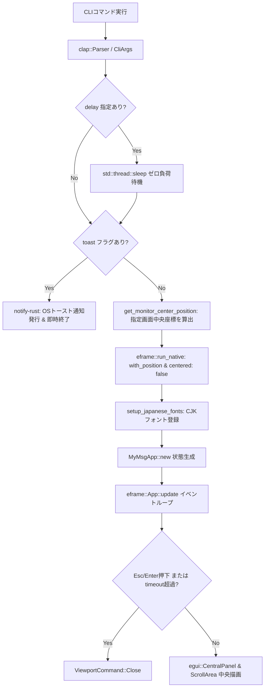
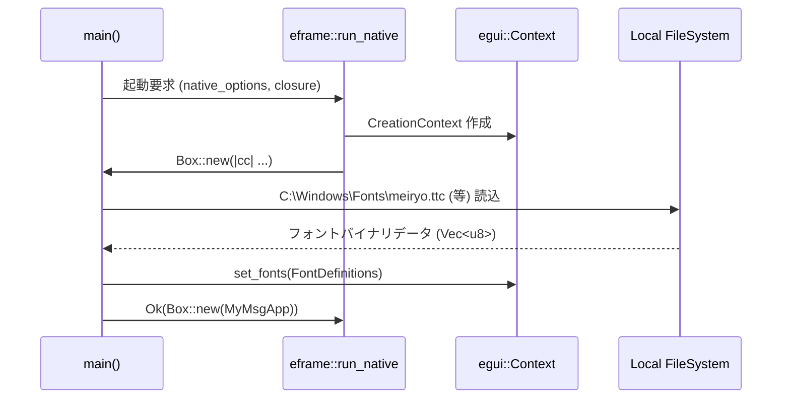

# MyMsg 内部設計書 (ARCHITECTURE)

本書は、`MyMsg` の内部アーキテクチャ、データフロー、モジュール構成、状態管理、レンダリングライフサイクル、およびエラーハンドリング方針について解説します。

---

## 1. 全体アーキテクチャ概要

`MyMsg` は、Rust の所有権モデルと `eframe` (即時モードGUI: Immediate Mode GUI) を基盤とした軽量通知アーキテクチャを採用しています。



---

## 2. ソースコードモジュール構成

ソースコードは責務ごとに以下の7モジュールに分割されています。

```
src/
├── main.rs       # エントリーポイント（main関数、遅延処理、Viewport初期化、トースト分岐）
├── cli.rs        # CLI引数定義（CliArgs, IconType, ThemeMode, MonitorTarget, 遅延/寸法計算）
├── color.rs      # カラーパーサー（parse_color, ThemePalette, テーマ解決）
├── font.rs       # 日本語・システムフォント自動検出・登録（setup_japanese_fonts）
├── monitor.rs    # マルチモニター・指定画面中央座標検出（Windows API / EnumDisplayMonitors）
├── toast.rs      # OSネイティブトースト通知送信（notify-rust）
└── app.rs        # GUI状態（MyMsgApp）& レンダリングループ（Galley上下中央配置、タイマー監視）
```

---

## 3. 主要構造体定義

### 3.1 `CliArgs` (`src/cli.rs`)
`clap::Parser` によるマクロ導出で、CLI からの入力文字列を安全に型付けされた構造体に変換します。

```rust
pub struct CliArgs {
    pub message_arg: Option<String>,
    pub message_opt: Option<String>,
    pub size: String,
    pub font_size: Option<f32>,
    pub color: Option<String>,
    pub bg_color: Option<String>,
    pub blink: bool,
    pub font: String,
    pub icon: Option<String>,
    pub theme: String,
    pub delay: String,
    pub monitor: String,
    pub timeout: u64,
    pub toast: bool,
}
```

### 3.2 `MyMsgApp` (`src/app.rs`)
GUI の実行中状態を保持します。

```rust
pub struct MyMsgApp {
    pub message: String,
    pub custom_text_color: Option<String>,
    pub custom_bg_color: Option<String>,
    pub theme_mode: ThemeMode,
    pub icon: Option<IconType>,
    pub font_id: FontId,
    pub font_size: f32,
    pub blink: bool,
    pub timeout_secs: u64,
    pub start_time: Instant,
}
```

---

## 4. レンダリングループとライフサイクル

### 4.1 即時モード GUI (Immediate Mode GUI)
`egui` は毎フレームUI定義を評価する即時モードを採用しています。

1. **入力・タイムアウト判定フェーズ**:
   - `Escape` または `Enter` キーの押下を検知した場合、直ちに `ViewportCommand::Close` を発行。
   - `timeout_secs > 0` かつ起動からの経過時間が指定秒数を超過した場合、自動的に `ViewportCommand::Close` を発行。
2. **点滅エフェクト計算フェーズ**:
   `blink == true` の場合、`start_time.elapsed()` から 0.5 秒の明滅判定を行い、`ctx.request_repaint_after(Duration::from_millis(250))` で次回描画を要求。
3. **パネル描画フェーズ**:
   `egui::CentralPanel` 内でスリムマージンを適用し、中央揃えでメッセージを描画。下部には閉じるボタンを配置。

---

## 5. フォントパイプライン (`setup_japanese_fonts`)

`eframe` 起動時のコンテキスト作成コールバック (`cc.egui_ctx`) において、OS システムから日本語フォントバイナリをロードします。



---

## 6. エラーハンドリング方針

- **CLI パースエラー**: `clap` が標準エラー出力にエラーメッセージとUsageを出力し、非ゼロの終了コードで即座に終了。
- **カラーパース失敗**: `parse_color` が `None` を返した場合は、テーマ標準色へ自動フォールバック。
- **フォントロード失敗**: OS に該当フォントが存在しない場合でもパニックせず、`egui` のデフォルトフォールバックフォントで継続動作。
- **遅延時間の異常値**: `clamp_delay_seconds` により、86400秒（24時間）を超える値は安全に 0〜86400秒の範囲にクランプ。
- **モニター取得フォールバック**: 指定されたインデックスやカーソル位置のモニターが取得できない場合は、プライマリモニターへ安全にフォールバック。
