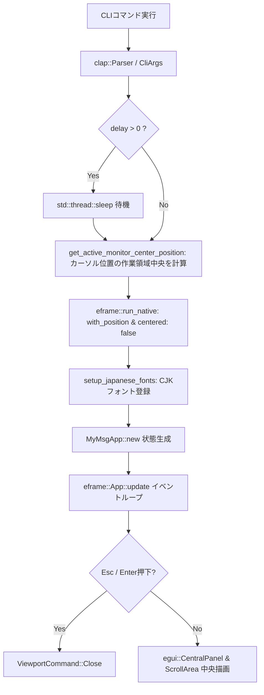
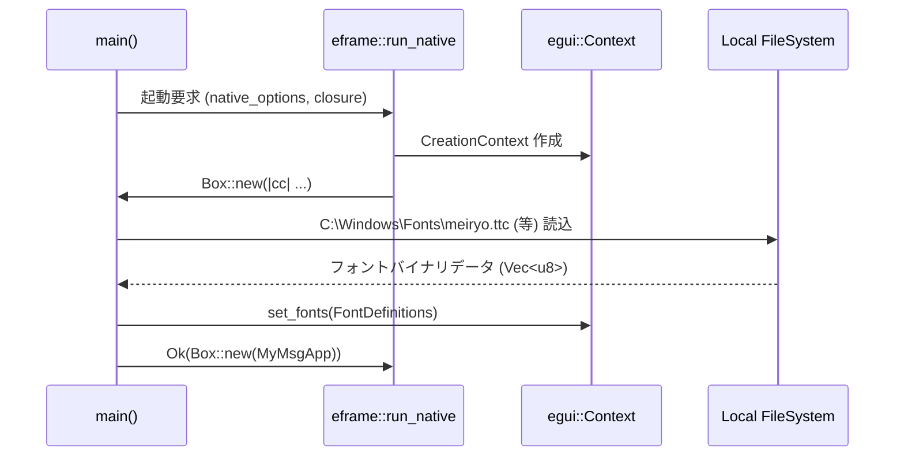

# MyMsg 内部設計書 (ARCHITECTURE)

本書は、`MyMsg` の内部アーキテクチャ、データフロー、モジュール構成、状態管理、レンダリングライフサイクル、およびエラーハンドリング方針について解説します。

---

## 1. 全体アーキテクチャ概要

`MyMsg` は、Rust の所有権モデルと `eframe` (即時モードGUI: Immediate Mode GUI) を基盤とした軽量通知アーキテクチャを採用しています。



---

## 2. ソースコードモジュール構成

ソースコードは責務ごとに以下の6モジュールに分割されています。

```
src/
├── main.rs       # エントリーポイント（main関数、遅延処理、Viewport初期化）
├── cli.rs        # CLI引数定義（CliArgs, IconType, ThemeMode, 引数解決・寸法計算）
├── color.rs      # カラーパーサー（parse_color, ThemePalette, テーマ解決）
├── font.rs       # 日本語・システムフォント自動検出・登録（setup_japanese_fonts）
├── monitor.rs    # マルチモニター・カーソル画面中央座標検出（Windows API）
└── app.rs        # GUI状態（MyMsgApp）& レンダリングループ（Galley上下中央配置）
```

---

## 3. 主要構造体定義

### 3.1 `CliArgs` (`src/cli.rs`)
`clap::Parser` によるマクロ導出で、CLI からの入力文字列を安全に型付けされた構造体に変換します。


```rust
pub struct CliArgs {
    pub message_arg: Option<String>,
    pub message_opt: Option<String>,
    pub size: String,
    pub font_size: Option<f32>,
    pub color: Option<String>,
    pub bg_color: Option<String>,
    pub blink: bool,
    pub font: String,
    pub delay: u64,
    pub icon: Option<String>,
    pub theme: Option<String>,
}
```

### 2.2 `MyMsgApp` (アプリケーション状態構造体)
GUI の実行中状態を保持します。

```rust
pub struct MyMsgApp {
    pub message: String,          // 描画テキスト
    pub text_color: Color32,      // メッセージ基本色
    pub bg_color: Color32,        // 背景色
    pub font_id: FontId,          // フォントサイズとファミリ
    pub blink: bool,              // 点滅フラグ
    pub start_time: Instant,      // 起動時刻（点滅位相計算用）
    pub icon: Option<IconType>,   // 通知アイコン種別
    pub theme: ThemeMode,         // テーマ設定
}
```

---

## 3. レンダリングループとライフサイクル

### 3.1 即時モード GUI (Immediate Mode GUI)
`egui` は毎フレームUI定義を評価する即時モードを採用しています。

1. **入力判定フェーズ**:
   `ctx.input(|i| ...)` を用いて `Escape` または `Enter` キーの押下を検知。押下時は直ちに `ViewportCommand::Close` を発行。
2. **点滅エフェクト計算フェーズ**:
   `blink == true` の場合、`start_time.elapsed()` から 0.5 秒の明滅判定を行い、`ctx.request_repaint_after(Duration::from_millis(250))` で次回描画を要求。
3. **パネル描画フェーズ**:
   `egui::CentralPanel` 内で極小スリムマージン (`Margin::symmetric(16.0, 10.0)`) を適用し、中央揃えでメッセージを描画。下部には閉じるボタンを配置。

---

## 4. フォントパイプライン (`setup_japanese_fonts`)

`eframe` 起動時のコンテキスト作成コールバック (`cc.egui_ctx`) において、OS システムから日本語フォントバイナリをロードします。



---

## 5. エラーハンドリング方針

- **CLI パースエラー**: `clap` が標準エラー出力にエラーメッセージとUsageを出力し、非ゼロの終了コードで即座に終了。
- **カラーパース失敗**: `parse_color` が `None` を返した場合は、デフォルト色（テキスト: `#F0F0F0`, 背景: `#1A1B26`）へ自動フォールバック。
- **フォントロード失敗**: OS に該当フォントが存在しない場合でもパニックせず、`egui` のデフォルトフォールバックフォント（ProggyClean等）で継続動作。
- **遅延時間の異常値**: `clamp_delay_seconds` により、負値や3600秒を超える値は安全に 0〜3600秒の範囲にクランプ。
