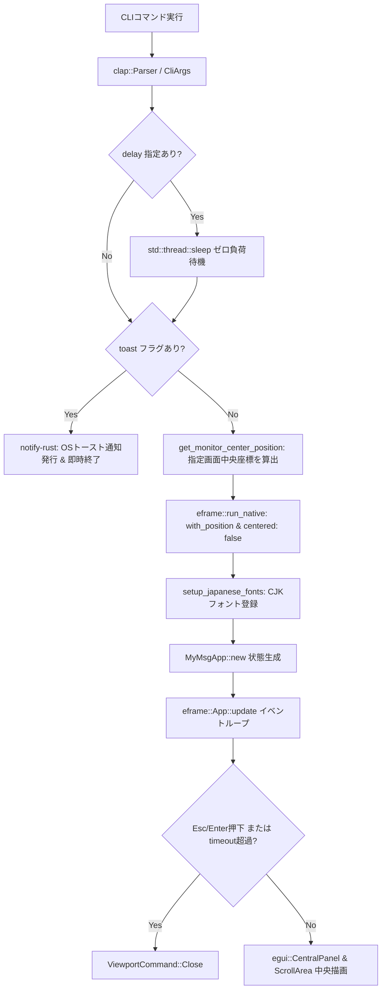
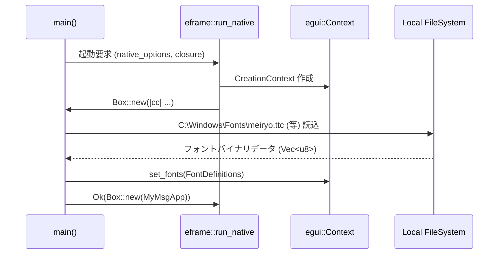

# MyMsg 内部設計書 (ARCHITECTURE)

本書は、`MyMsg` の内部アーキテクチャ、データフロー、モジュール構成、状態管理、レンダリングライフサイクル、およびエラーハンドリング方針について解説します。

---

## 1. 全体アーキテクチャ概要

`MyMsg` は、Rust の所有権モデルと `eframe` (即時モードGUI: Immediate Mode GUI) を基盤とした軽量通知アーキテクチャを採用しています。


```mermaid
graph TD
    CLI[CLIコマンド実行] --> ArgParser[clap::Parser / CliArgs]
    ArgParser --> DelayCheck{delay 指定あり?}
    DelayCheck -- Yes --> Sleep[std::thread::sleep ゼロ負荷待機]
    DelayCheck -- No --> ToastCheck
    Sleep --> ToastCheck{toast フラグあり?}
    ToastCheck -- Yes --> SendToast[notify-rust: OSトースト通知発行 & 即時終了]
    ToastCheck -- No --> MonDetect[get_monitor_center_position: 指定画面中央座標を算出]
    MonDetect --> WinInit[eframe::run_native: with_position & centered: false]
    WinInit --> FontSetup[setup_japanese_fonts: CJKフォント登録]
    FontSetup --> AppState[MyMsgApp::new 状態生成]
    AppState --> EventLoop[eframe::App::update イベントループ]
    EventLoop --> KeyCheck{Esc/Enter押下 または timeout超過?}
    KeyCheck -- Yes --> CloseCmd[ViewportCommand::Close]
    KeyCheck -- No --> Render[egui::CentralPanel & ScrollArea 中央描画]
```

---

## 2. ソースコードモジュール構成

ソースコードは責務ごとに以下のサブモジュール構成に整理されています。

```
src/
├── main.rs       # エントリーポイント（main関数、セッション判定、遅延処理、定期実行、トースト分岐）
├── cli/          # CLI 引数パース・型・計算モジュール
│   ├── mod.rs    # サブモジュール宣言 & 後方互換性維持のための pub use 再エクスポート
│   ├── args.rs   # CliArgs 構造体定義および clap 属性・ヘルプ文章
│   ├── types.rs  # IconType, ThemeMode, MonitorTarget 列挙型およびパーサー
│   ├── time.rs   # 時間単位・遅延・HH:MMスケジュール計算関数群
│   └── layout.rs # ウィンドウ寸法・フォントサイズ計算、メッセージ改行解決
├── color.rs      # カラーパーサー（parse_color, ThemePalette, テーマ解決）
├── font.rs       # 日本語・システムフォント自動検出・登録（setup_japanese_fonts）
├── monitor.rs    # マルチモニター・指定画面中央座標検出（Windows API / EnumDisplayMonitors）
├── toast.rs      # OSネイティブトースト通知送信（notify-rust）
├── app.rs        # GUI状態（MyMsgApp）& レンダリングループ（Galley上下中央配置、タイマー監視、操作ボタン）
├── log.rs        # ログファイル追記モジュール（append_log, 各種イベント記録）
├── session.rs    # 対話型セッション・Session 0 検出モジュール（is_interactive_session）
└── sound.rs      # システム通知音・ビープ音再生モジュール（play_notification_sound）
```

---

## 3. 主要構造体定義

### 3.1 `CliArgs` (`src/cli/args.rs`)
`clap::Parser` によるマクロ導出で、CLI からの入力文字列を安全に型付けされた構造体に変換します。

```rust
pub struct CliArgs {
    pub message_arg: Option<String>,
    pub message_opt: Option<String>,
    pub size: String,
    pub font_size: Option<f32>,
    pub color: Option<String>,
    pub bg_color: Option<String>,
    pub blink: bool,
    pub font: String,
    pub icon: Option<String>,
    pub theme: String,
    pub delay: String,
    pub monitor: String,
    pub timeout: u64,
    pub toast: bool,
    pub interval: Option<String>,
    pub at: Option<String>,
    pub count: u64,
    pub immediate: bool,
    pub show_progress: bool,
    pub log: Option<std::path::PathBuf>,
    pub copy: bool,
    pub action: Option<String>,
    pub sound: bool,
}
```

### 3.2 `MyMsgApp` (`src/app.rs`)
GUI の実行中状態を保持します。

```rust
pub struct MyMsgApp {
    pub message: String,
    pub custom_text_color: Option<String>,
    pub custom_bg_color: Option<String>,
    pub theme_mode: ThemeMode,
    pub icon: Option<IconType>,
    pub font_id: FontId,
    pub font_size: f32,
    pub blink: bool,
    pub timeout_secs: u64,
    pub show_progress: bool,
    pub log_path: Option<PathBuf>,
    pub copy_enabled: bool,
    pub copied_feedback_until: Option<Instant>,
    pub action_cmd: Option<String>,
    pub action_feedback_until: Option<(Instant, bool)>,
    pub start_time: Instant,
    pub interval_secs: Option<u64>,
    pub schedule_time: Option<chrono::NaiveTime>,
    pub max_count: u64,
    pub current_count: u64,
    pub should_exit_all: std::sync::Arc<std::sync::atomic::AtomicBool>,
    pub is_closing: bool,
}
```

---

## 4. レンダリングループとライフサイクル

### 4.1 即時モード GUI (Immediate Mode GUI)
`egui` は毎フレームUI定義を評価する即時モードを採用しています。

1. **入力・タイムアウト判定フェーズ**:
   - `Esc` キー押下（または「✕ 中止」ボタンクリック）：定期実行中であっても `should_exit_all` を `true` に設定し、直ちにプロセスを完全終了。
   - `Enter` キー押下（または「✓ 今回閉じる」ボタンクリック）：次回スケジュール（`--interval` 継続時）がある場合は `should_exit_all` を立てずに今回のみ閉じて次回待機へ移行。次回がない場合は完全終了。
   - `timeout_secs > 0` かつ起動からの経過時間が指定秒数を超過した場合、自動的に `ViewportCommand::Close` を発行（定期実行時は次回待機へ移行）。
2. **点滅エフェクト計算フェーズ**:
   `blink == true` の場合、`start_time.elapsed()` から 0.5 秒の明滅判定を行い、`ctx.request_repaint_after(Duration::from_millis(250))` で次回描画を要求。
3. **パネル描画フェーズ**:
   `egui::CentralPanel` 内でスリムマージンを適用し、中央揃えでメッセージを描画。下部バーにはコピー、アクション、閉じる/中止ボタンを配置。

---

## 5. フォントパイプライン (`setup_japanese_fonts`)

`eframe` 起動時のコンテキスト作成コールバック (`cc.egui_ctx`) において、OS システムから日本語フォントバイナリをロードします。


```mermaid
sequenceDiagram
    participant Main as main()
    participant Runner as eframe::run_native
    participant Ctx as egui::Context
    participant FS as Local FileSystem

    Main->>Runner: 起動要求 (native_options, closure)
    Runner->>Ctx: CreationContext 作成
    Runner->>Main: Box::new(|cc| ...)
    Main->>FS: C:\Windows\Fonts\meiryo.ttc (等) 読込
    FS-->>Main: フォントバイナリデータ (Vec<u8>)
    Main->>Ctx: set_fonts(FontDefinitions)
    Main->>Runner: Ok(Box::new(MyMsgApp))
```

---

## 6. エラーハンドリング方針

- **CLI パースエラー**: `clap` が標準エラー出力にエラーメッセージとUsageを出力し、非ゼロの終了コードで即座に終了。
- **カラーパース失敗**: `parse_color` が `None` を返した場合は、テーマ標準色へ自動フォールバック。
- **フォントロード失敗**: OS に該当フォントが存在しない場合でもパニックせず、`egui` のデフォルトフォールバックフォントで継続動作。
- **遅延時間の異常値**: `clamp_delay_seconds` により、86400秒（24時間）を超える値は安全に 0〜86400秒の範囲にクランプ。
- **モニター取得フォールバック**: 指定されたインデックスやカーソル位置のモニターが取得できない場合は、プライマリモニターへ安全にフォールバック。
