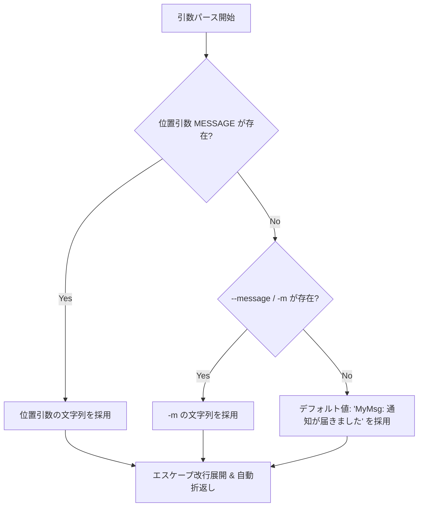

# MyMsg 詳細機能仕様書 (SPECIFICATION)

本書は、超軽量・最前面固定メッセージポップアップ通知CLIツール `MyMsg` の詳細な機能仕様、コマンドライン引数、UI挙動、フォント・カラー処理、終了条件および制約事項を定義します。

---

## 1. 概要と動作モデル

`MyMsg` は、Rust の GUI フレームワーク `eframe` (`egui`) および CLI パーサー `clap` を用いて実装されたスタンドアロン型デスクトップ通知ツールです。

- **実行モデル**: 単一の同期プロセスとして起動。
- **ウィンドウモデル**: ネイティブ OS ウィンドウを最前面固定（Always on Top）かつ固定サイズで表示。
- **レンダリングモデル**: イベント駆動描画（点滅時を除きアイドル時は再描画を行わず CPU 使用率 0% を維持）。

---

## 2. コマンドライン引数仕様

`clap` (derive マクロ) により解析されるコマンドライン構文は以下の通りです。

```
Usage: MyMsg.exe [OPTIONS] [MESSAGE]
```

### 2.1 位置引数 (Positional Arguments)

| 引数名 | 型 | 必須/省略 | 説明 |
| :--- | :--- | :---: | :--- |
| `MESSAGE` | String | 省略可 | 表示するメッセージ文字列（第1位置引数）。 |

### 2.2 オプションフラグ (Options)

| 長縮名 | 短縮名 | 値の型 | デフォルト値 | 説明 |
| :--- | :---: | :---: | :---: | :--- |
| `--message` | `-m` | `String` | なし | 表示するメッセージ文字列。 |
| `--size` | `-s` | `String` | `"medium"` | ウィンドウサイズプリセット (`small`, `medium`, `large` または `s`, `l`)。 |
| `--font-size`| - | `f32` | なし | メッセージ文字のフォントサイズ (pt単位)。指定時はプリセット値を上書き。 |
| `--color` | `-c` | `String` | 省略時テーマ色 | メッセージ文字色。色名、1文字略称、タイポ補正、HEXコードに対応。 |
| `--bg-color` | - | `String` | 省略時テーマ色 | ウィンドウ背景色。HEXコードまたは色名に対応。 |
| `--blink` | `-b` | `bool` | `false` | メッセージ文字の点滅（約0.5秒周期の明滅）エフェクトを有効化。 |
| `--font` | `-f` | `String` | `"default"`| フォント種別 (`default`/`sans`, `mono`/`2`/`monospace`, `serif`/`3`, `impact`)。 |
| `--icon` | `-i` | `String` | なし | アイコン表示種別 (`info`, `warn`, `error`, `ok`)。 |
| `--theme` | `-t` | `String` | `"system"` | テーマ設定 (`system`, `dark`, `light`)。 |
| `--delay` | `-d` | `String` | `"0"` | 待機秒数または指定時刻 (`12:00`, `10m`, `1h`)。最大24時間 (86400秒) に制限。 |
| `--monitor`| - | `String` | `"cursor"` | 表示先モニター指定 (`cursor`, `primary`, `0`, `1`, `2`...)。 |
| `--timeout`| - | `u64` | `0` | 自動消去タイマー (秒単位、0は無効で手動終了まで待機)。 |
| `--toast` | `-T` | `bool` | `false` | OS標準のトースト通知モード（GUI非生成・即時終了）。 |
| `--help` | `-h` | - | - | ヘルプメッセージを出力して終了。 |
| `--version` | `-V` | - | - | バージョン情報を出力して終了。 |

---

## 3. メッセージ優先順位解決と複数行・折返し仕様 (`resolve_message`)

メッセージ文字列は以下の優先順位に従って決定され、エスケープ改行文字が展開されます：

1. 位置引数 (`MESSAGE`) があれば最優先採用
2. `-m` / `--message` があれば採用
3. いずれもなければデフォルト通知メッセージ（`"MyMsg: 通知が届きました"`）を採用
4. 文字列内の `\n` および `\r\n` は実際の改行として展開・複数行表示
5. 長文メッセージはウィンドウ幅に応じて自動折り返し（ワードラップ）され、縦スクロール領域により見切れを防止します。



---

## 4. アイコン表示仕様 (`--icon` / `-i`)

`--icon <種別>` を指定することで、メッセージの左側にベクターシンボルを描画します。

| 指定キーワード | 略称・エイリアス | 表示シンボル | デフォルトシンボル色 |
| :--- | :--- | :---: | :--- |
| `info` | `i`, `information` | `ℹ` | `#38BDF8` (Sky Blue) |
| `warn` | `w`, `warning`, `alert` | `⚠` | `#FBBF24` (Amber / Yellow) |
| `error` | `e`, `err`, `danger`, `ng` | `✖` | `#F87171` (Light Red) |
| `ok` | `s`, `k`, `success`, `check` | `✔` | `#4ADE80` (Green) |

---

## 5. テーマ仕様 (`--theme` / `-t`)

`--theme` により UI 全体の配色プリセットを切り替えます。

| テーマ指定値 | 動作 | デフォルト背景色 | デフォルト文字色 | ボタン背景色 |
| :--- | :--- | :---: | :---: | :---: |
| `system` (既定) | OSのダーク/ライトモード設定を自動検出して追従 | OS準拠 | OS準拠 | OS準拠 |
| `dark` (`d`) | ダークモード固定 | `#1A1B26` | `#F0F0F0` | `#2D3041` |
| `light` (`l`) | ライトモード固定 | `#F8FAFC` | `#0F172A` | `#E2E8F0` |

> [!NOTE]
> `--color` または `--bg-color` が明示的に指定された場合、テーマのデフォルト配色よりもユーザー指定色が最優先されます。

---

## 6. マルチモニター・画面中央配置仕様 (`get_active_monitor_center_position`)

複数ディスプレイ使用時、ウィンドウの初期表示位置は以下のロジックで決定されます：

1. **現在のアクティブモニター自動検出 (Windows)**:
   - 起動時のマウスカーソル物理座標（`GetCursorPos`）から、カーソルが存在するディスプレイ（`MonitorFromPoint`）を特定。
   - 該当モニターの作業領域（`rcWork`: タスクバー等を除外した実効領域）を取得。
   - 物理ピクセル単位で `X = rcWork.left + (rcWork.width - window_width) / 2`、`Y = rcWork.top + (rcWork.height - window_height) / 2` を算出してウィンドウを配置。
2. **eframe NativeOptions 連携**:
   - `centered: false` を設定することで、eframe が生成後にプライマリモニターへ強制再移動（`set_outer_position`）する上書き動作を防止。
3. **フォールバック**:
   - 検出に失敗した場合や非Windows環境では、OS/WindowManager の既定位置（またはプライマリモニター）に配置されます。

---

## 7. ウィンドウ寸法とフォントサイズ計算 (`calculate_window_dimensions`)

`--size` (`-s`) 引数および `--font-size` からウィンドウの幅・高さ、文字サイズを算出します。

| サイズ指定値 | 判定キーワード | 幅 (Width) | 高さ (Height) | デフォルト文字サイズ (pt) |
| :--- | :--- | :---: | :---: | :---: |
| **Small** | `small`, `s` | 300.0 px | 150.0 px | 20.0 pt |
| **Medium** (既定) | `medium`, その他 | 450.0 px | 220.0 px | 26.0 pt |
| **Large** | `large`, `l` | 650.0 px | 350.0 px | 36.0 pt |

> [!NOTE]
> `--font-size <pt>` が明示的に指定された場合、サイズプリセットのデフォルト文字サイズは無視され、指定値が適用されます（ウィンドウ寸法はプリセットに従います）。

---

## 8. カラーパーサー仕様 (`parse_color`)

`--color` および `--bg-color` に指定可能なカラー表現は以下の通りです。大文字小文字は無視されます。

### 7.1 プリセット色名 & 1文字略称

| カラー名 | 1文字略称 | 和名 | タイポ補正 | RGB値 (HEX) |
| :--- | :---: | :---: | :---: | :--- |
| `red` | `r` | `赤` | - | `#EF4444` (239, 68, 68) |
| `green` | `g` | `緑` | - | `#22C55E` (34, 197, 94) |
| `blue` | `b` | `青` | `bule` | `#3B82F6` (59, 130, 246) |
| `yellow` | `y` | `黄` | - | `#EAB308` (234, 179, 8) |
| `orange` | `o` | - | - | `#F97316` (249, 115, 22) |
| `purple` | `p` | - | - | `#A855F7` (168, 85, 247) |
| `cyan` | `c` | - | - | `#06B6D4` (6, 182, 212) |
| `pink` / `magenta` | `m` | - | - | `#EC4899` (236, 72, 153) |
| `white` | `w` | `白` | - | `#FFFFFF` (255, 255, 255) |
| `black` | `k` | `黒` | - | `#0A0A0F` (10, 10, 15) |

### 8.2 拡張パレット色
`lime`, `gold`, `amber`, `emerald`, `teal`, `sky`, `indigo`, `violet`, `rose`, `crimson`, `navy`, `gray` / `grey` / `gray500`, `dark` / `darkgray`, `light` / `lightgray`

### 8.3 HEXカラーコード形式
- **6桁 HEX**: `#RRGGBB` または `RRGGBB`
- **3桁 HEX**: `#RGB` または `RGB` (例: `#F00` → `#FF0000`)
- **8桁 HEX**: `#RRGGBBAA` または `RRGGBBAA` (アルファ透過度含む)

---

## 9. タイマー / 遅延表示機能 (`parse_delay_to_seconds`, `clamp_delay_seconds`)

`--delay <指定>` (`-d`) を指定した場合：
1. 指定文字列は以下のように柔軟に解析され、秒数に変換されます：
   - **秒数指定**: `60`, `300`, `3600` 等
   - **単位付き指定**: `10s` (秒), `10m` / `10分` (分), `1h` / `1時間` (時間)
   - **時刻指定**: `12:00`, `17:30:00` 等（現在時刻との差分秒数を自動計算。過去の時刻の場合は翌日の同時刻として計算）
2. 算出された待機秒数は `clamp_delay_seconds(delay)` により安全範囲（`0` 〜 `86400` 秒 / 最大24時間）に丸められます。
3. GUI ウィンドウの構築前（またはトースト通知送信前）に `std::thread::sleep` により待機します。
4. 待機中はグラフィックスコンテキストやウィンドウリソースが一切確保されないため、CPU/メモリ負荷は実質ゼロです。

---

## 10. 点滅アニメーション仕様 (`--blink`)

`--blink` (`-b`) が指定された場合：
- 起動時刻（`Instant::now()`）からの経過秒数を元に `(elapsed % 1.0) < 0.5` を判定。
- 前半 0.5 秒: 本来の不透明色 (`Alpha = 255`) で描画。
- 後半 0.5 秒: 減衰アルファ色 (`Alpha = 30`) で描画。
- `ctx.request_repaint_after(Duration::from_millis(250))` により省電力再描画をスケジュール。

---

## 11. 日本語フォント自動ロード仕様 (`setup_japanese_fonts`)

`egui` のデフォルトフォントには CJK（日本語）グリフが含まれないため、起動時に OS システムフォントを検索して登録します。

- **Windows**:
  - `meiryo.ttc` (メイリオ)
  - `YuGothM.ttc` (游ゴシック Medium)
  - `msgothic.ttc` (MS ゴシック)
  - `msmincho.ttc` (MS 明朝 - Serif 用)
- **macOS**: `Hiragino Sans GB.ttc`, `PingFang.ttc`
- **Linux**: `NotoSansCJK-Regular.ttc`

登録ファミリ:
- `FontFamily::Proportional`: 優先度第1位に日本語フォントを挿入。
- `FontFamily::Monospace`: フォールバックリストに追加。
- `FontFamily::Name("serif")`: 明朝体または日本語フォントを登録。

---

## 12. モニター配置仕様 (`--monitor`)

`--monitor <TARGET>` によりポップアップの表示先ディスプレイを指定します。

| 指定値 | 挙動 |
| :--- | :--- |
| `cursor` (既定値) / `c`, `mouse`, `active` | 現在マウスカーソルが存在するモニターの作業領域中央に配置 |
| `primary` / `p`, `main` | プライマリモニター（メインディスプレイ）の作業領域中央に配置 |
| `0`, `1`, `2` ... | 列挙されたモニターの指定インデックス番号の作業領域中央に配置（範囲外時はプライマリへフォールバック） |

---

## 13. 自動消去タイマー仕様 (`--timeout`)

`--timeout <秒>` を指定した場合：
- ウィンドウ表示後、指定秒数が経過すると自動的に `ViewportCommand::Close` が発行され、正常終了（終了コード `0`）します。
- `0`（デフォルト）の場合は無効化され、キーボード入力（`Esc` / `Enter`）や閉じる操作が行われるまで常時表示されます。

---

## 14. OS標準トースト通知仕様 (`--toast` / `-T`)

`--toast` を指定した場合：
- GUI ウィンドウ（`eframe`）を一切生成せず、OS ネイティブのデスクトップ通知センター（Windows トースト通知 / macOS / Linux）へ直接メッセージを送信します。
- 送信後、直ちにプロセスは正常終了（終了コード `0`）します。
- `--icon` が指定されている場合、通知サマリーにアイコンシンボル（`ℹ`, `⚠`, `✖`, `✔`）が付与されます。
- `--delay <秒>` と組み合わせた場合、指定秒数スリープした後にトースト通知が送信されます。

---

## 15. ユーザーインタラクションと終了条件

| 操作 / トリガー | 挙動 | 終了コード |
| :--- | :--- | :---: |
| **Esc キー押下** | ウィンドウを直ちに閉じプロセス終了 | `0` |
| **Enter キー押下** | ウィンドウを直ちに閉じプロセス終了 | `0` |
| **「✕ 閉じる」ボタン押下** | ウィンドウを直ちに閉じプロセス終了 | `0` |
| **ウィンドウの「✕」ボタン** | 通常のウィンドウ破棄処理を経て終了 | `0` |
| **`--timeout` 経過** | 指定秒数経過後に自動終了 | `0` |
| **`--toast` 実行完了** | トースト通知発行後に即時終了 | `0` |

---

## 16. 制約事項
- 最大待機遅延時間は 86400 秒 (24 時間) です。
- 本ツールはシングルウィンドウ表示専用であり、複数同時起動時はプロセスごとに独立したウィンドウが生成されます。

